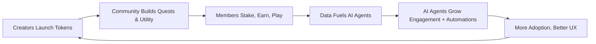

# Wanderia Builder Playbook

**Last Updated: August 2025**  
_This is the regenerative, high-leverage, and interoperable playbook for building Wanderia: a next-gen decentralized social coordination layer for communities and creators._

---

## 🌐 Overview

Wanderia is a sovereign community network and interoperable coordination layer that combines:
- AI agents for communities
- Regenerative token economies
- DAO-native tools (launchpad, quests, etc.)
- Protocol-level composability across Solana, Nostr, ATProto, Farcaster
- Creator-native monetization models

This playbook contains:
- Product & Technical Architecture
- Token & Incentive Systems
- Business Model & Revenue Streams
- Flywheel Mechanics

---

## 🧠 1. Product & Technical Stack

### Core Features

- **Launchpad:** For social and regenerative communities to launch tokens and NFTs in a sustainable way.
- **Sovereign AI Agents:** Like aixbt, griffain, eliza-os. Each community can summon their own AI persona with memory, context, and integration.
- **Quest System:** Onchain contribution and coordination layer. Members earn rewards for work, learn-to-earn, or social actions.
- **Soft-staking & Loyalty:** Users and holders lock tokens to gain benefits, tiered access, or status in their communities.
- **Raffles & Auctions:** For community-led distribution of digital goods and experiences.
- **Regenerative Token Tools:** Fairmint-style token issuance, vesting, liquidity bootstrapping.
- **Cross-Protocol Identity:** `did:wander:` identity layer unifying Solana, Nostr, Farcaster, ATProto

### Tech Stack

- **Frontend:** React + Tailwind + shadcn/ui
- **Backend:** Node.js + PostgreSQL + Redis
- **Blockchain:** Solana (core), with support for interop via DID adapters to Nostr, ATProto, Farcaster
- **AI Infra:** Ollama + LangChain + Vector DB (Weaviate or Chroma) for sovereign AI agents
- **Identity:** `did:wander:` with composable keys per protocol

---

## 🔁 2. Flywheel Mechanics

- Creator launches token/NFT via launchpad
- Builds utilities via quests, raffles, soft-staking
- Community activity generates value and data
- AI agents learn, automate, and coordinate
- All loops back into more creator launches & value

---

## 🪙 3. Token Framework

### Token Type: $WANDER
- Native utility + governance token of Wanderia

#### Utilities:
- Pay for AI agents
- Access premium launchpad features
- Stake to unlock new modules/tools
- Participate in DAO governance
- Reward pool for contributors, communities

#### Token Distribution (Sample Draft):
- 35% Community Rewards (quests, staking)
- 20% Core Team & Future Contributors (vested)
- 15% Treasury / DAO reserve
- 15% Strategic Investors (unlocks w milestones)
- 10% Creator Onboarding / Retroactive Grants
- 5% Liquidity Bootstrapping

#### Mechanics:
- **Soft-Staking:** For social incentives and access
- **Buyback Vaults:** % of revenue buys $WANDER to recycle into the ecosystem
- **Multi-token Support:** Each community can issue their own token/NFT atop $WANDER

---

## 💸 4. Business Model

### Platform Revenue Streams:
- Launchpad Fees (e.g. 2-5% of token/NFT raise)
- AI Agent Hosting & Compute
- Premium Tool Subscriptions (e.g. for quests, DAO tools, analytics)
- % Fee on Raffles / Auctions
- Creator Economy Revshare (e.g. split on NFT drops, token sales)

### Creator Monetization:
- Token + NFT sales
- Raffle revenue
- Soft-staking loyalty programs
- Premium content unlocks (AI, quests, status)
- AI agent consulting (e.g. selling prompt packs, memory packs)

---

## 🔓 5. For Builders & Contributors

We are building Wanderia as:
- Fully open-source from core
- Modular and permissionless
- With composable SDKs & APIs

**Opportunities:**
- Build sovereign AI personas
- Extend modules (e.g. new staking models, reputation layers)
- Protocol adapters (e.g. plug Wanderia to Lens, Mastodon, etc.)
- Launch your own community within Wanderia

---

## 🔥 6. Differentiation Summary

- **AI x Community:** First platform letting communities own and train their own sovereign AI agents.
- **Regen-first Tokenomics:** Designed to grow value long-term instead of pump & dump.
- **Protocol-native Interop:** Unified identity and token logic across 4+ major decentralized social protocols.
- **Composability:** Every feature is built to be forkable, extendable, and API-accessible.

---

## 🛠️ Next Steps (For Builders)

- [ ] Complete MVP for Launchpad + AI agents
- [ ] Design $WANDER token smart contracts
- [ ] Open public dev sandbox for community experiments
- [ ] Write SDK & module docs
- [ ] Publish testnet launch for 2–3 pilot creators

> For collaboration, reach out via X @d0rukeray or visit [wanderia.xyz](https://wanderia.xyz)

---

**Wander well. Build freely. Stay regenerative.**

